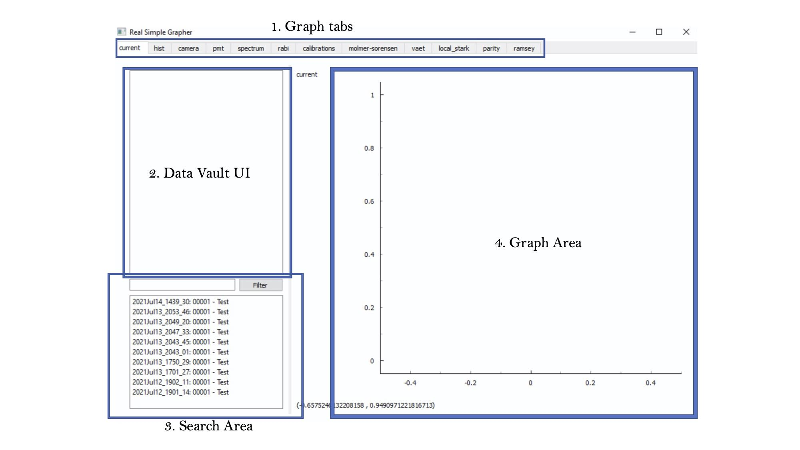

# RSG Summary
RSG - Real Simple Grapher, is utilized to draw graphs with optional real time update features. In the page you will learn how to direct yourself through its codebase.
checkout the LabRAD RSG [Wiki](https://github.com/HaeffnerLab/RealSimpleGrapher/wiki)

## Run RSG
The path in this following section is subjected to change, and it's based on the filepath in LabRad_PC.
1. To start the real simple graph, we first need to start the labrad manager. It's a process that would listen to requests and manage all the other processes.
    - Go to C:\Users\funin\Documents\GitHub\Lab_control\scalabrad-0.8.3\bin
    - Double clicked labrad.bat
    - You should see a command prompt being open

2. Then, we need to start data vault & parameter vault; open two anaconda prompts; enter the following commands into both of the prompts.
    ```sh
    $ conda activate code3
    $ cd C:\Users\funin\Documents\GitHub\Lab_control\servers
    ```
    
    for data vault:
    ```sh
    $ cd data_vault & python data_vault_tables.py
    ```
    for parameter vault:
    ```sh
    $ cd parameter_vault & python parameter_vault.py
    ```
3. Start the rsg; Open another anaconda prompt, and enter the following commands.
    ```sh
    $ conda activate code3
    $ cd C:\Users\funin\Documents\GitHub\Lab_control\pyqt5_clients\RealSimpleGrapher-revised
    $ python rsg.py
    ```

### About RSG, UI Layout



### Project File Map:
[I only commented the ones that I have an understanding of]
- **GUIConfig**: controls the Graph tabs, some color presets for graphs, foreground and background colors settings.
- ***WidgetGraph**: anything ends with widgetGraph or similar is for the type of graphs that we draw in the graph area. Right now we have three major different ones: connected scatterplot, histogram, and image(used only for camera) graph.
- **DataVaultListWidget**: The displayed box for the Data Vault UI area. When we right click the Data Vault UI area to add an dataset, or double clicked one of the files in the search area, we are utilizing this file.
- **TraceListWidget**:  the TraceListWidget is the one we use to populate the DataVaultListWidget
- **ParameterListWidget**: The displayed box when we try to fit a dataset that we are drawing. (right click any traceListWidget, and then we could see an fit option)
- **rsg**: main entry point for the grapher
- **Dataset**: connection point with the backend datavault

### Major Things To Worry
In files ending with **WidgetGraph**, the following functions are what you would need to worry about the most:
- initUI: initialize and setup the UI layout
- update_figure: get called in a loop to actively update the figure drawing
- add_artist: whenever a dataset is added, this would get called to draw the figure
- remove_artist: whenever a dataset is removed, this would get called to remove the dataset from the figure
- add_dataset: whenver a dataset is added, this would get called to add the dataset to the system
- remove_dataset: whenever a datset is removed, this would get called to remove the dataset from the system
- display & checkboxChanged: in a graph tab that allows multiple datasets, this is used to control which dataset(s) to be shown on the figure

In the file **RecentFilesListWidget**, the logic is to sort the folders by folder name (dates); And we only did that sorting if the date has changed since we last executed the filter function. *populate()* would be the function that worth taking a look, as it has some not complex but redundant logic to cd into those date folders and read the files iteratively.

One recommendation to debug if you cannot locate the code is to look at which area of the rsg you're working on, and then added a lot of print statements. Sometimes when rsg encounters errors, print statement would get stuck, one can mitigate that by doing what you did to the rsg again. (for example, add the same file twice)

### Changes Made:
#### 1. Colors
Different colors of the graphs and their fitting graphs can be changed in GUIConfig file. It's put into the config file for better management purposes, as it's easier to change the colors in a centralized place rather than finding the code corresponding to it; Changes made include multiple files which utilizes the two varaibles in GUIConfig. These files can be found via some terminal command such as:

```
$ grep -r "GLOBALFITCOLORS" .
```

Whenever a dataset is added(aka, a file is double clicked and been drawn), the generator will give it a color; Then the next color given would be the next one in the loop; We can also choose what color to assign by right clicking the file in the traceListWidget.

The opacity varaible is for histogram and its fitting, it can be set to "FF" for not transparent.

#### 2. Recent Files
At the initialization step, recent file list is populated by the latest 10 files sorted by date. The number 10 can be changed in RecentFilesListWidget;

RecentFilesListWidget extends QListWidget, which means it is just a customized pyqt listWidget which can load our data in the way we want. In order to dislay it, we need to put this widget element somewhere. Similar to above, you can use
```
$ grep -r "RecentFilesListWidget" .
```
to see where in the codebase called RecentFilesListWidget. It's probably used within all the files that ends with WidgetGraph.

#### 3. Image Graph
CameraWidgetGraph is different from the normal one as it is designed to take in only one dataset at a time. And the dataset format should be a matrix. The data is designed to be drawn up->down, with a fixed height which can be updated by utlizing the inputbox on the camera graph page. It's only tested on fake data so far, so it might have some bugs when using against real life data.

[Fit functionality should be disabled on this graph]


